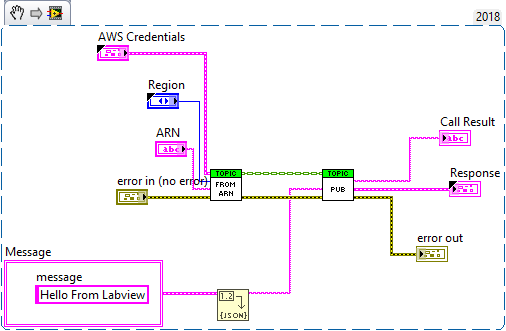

# SNS

## Example on how to publish to a SNS topic



The IAM user that is publishing to the SNS topic `arn:aws:sns:us-east-1:123456789012:example-sns-topic` needs to at least have the IAM policy below:
```json
{
    "Version": "2012-10-17",
    "Statement": [
        {
            "Sid": "AllowUserToPublishToExampleSNSTopic",
            "Effect": "Allow",
            "Action": "sns:Publish",
            "Resource": [
                "arn:aws:sns:us-east-1:123456789012:example-sns-topic"
            ]
        }
    ]
}
```